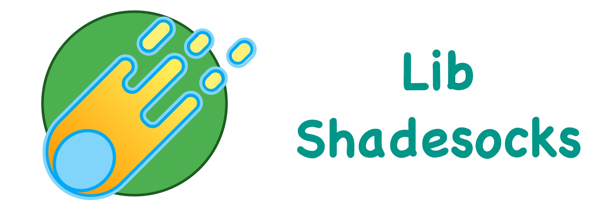

# LibShadesocks



## build command

```bash
# make sure the submodule is loaded
git submodule update --init --recursive

mkdir build && cd build && cmake -DCMAKE_BUILD_TYPE=Release .. && make

```

## usage

add `add_subdirectory("libshadesocks")` in `CMakeLists.txt`

```cpp
#include "ss.h"

auto loop = shadesocks::Loop::getDefault();

auto tcp = loop->create_tcp_handle();
try {
    tcp->bind("0.0.0.0", 1080);
    tcp->listen();
    loop->run();
} catch (shadesocks::UvException& uvException) {
    LOG(ERROR) << uvException.what();
}
```

## Thanks 
Without the following repository, there could not be such a project.

[nodejs/node](https://github.com/nodejs/node)

[libuv/libuv](https://github.com/libuv/libuv)

[cryptopp/releases](https://github.com/weidai11/cryptopp/releases)

[noloader/cryptopp-cmake](https://github.com/noloader/cryptopp-cmake)

[skypjack/uvw](https://github.com/skypjack/uvw)

